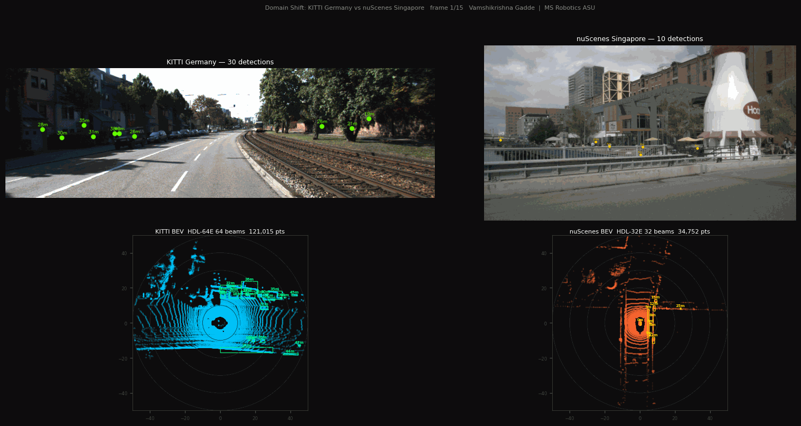
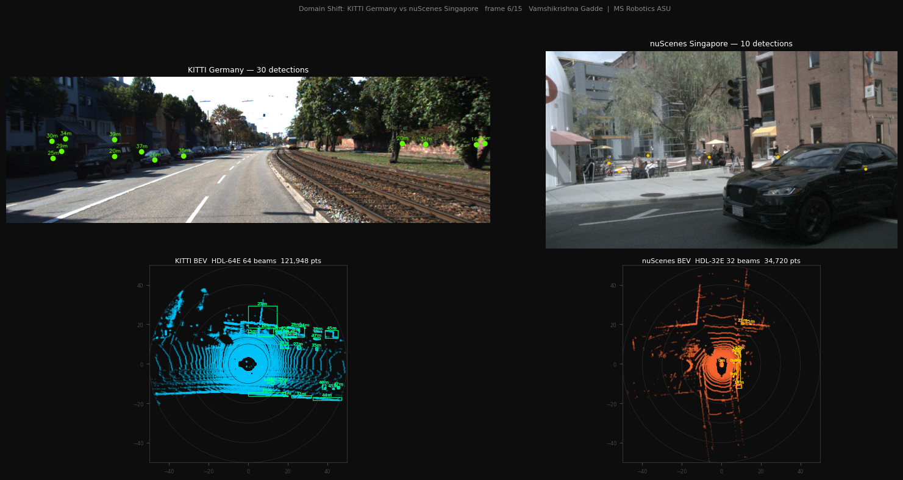
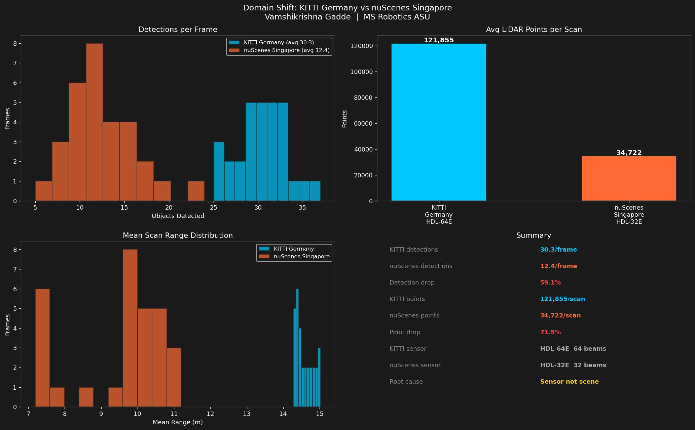
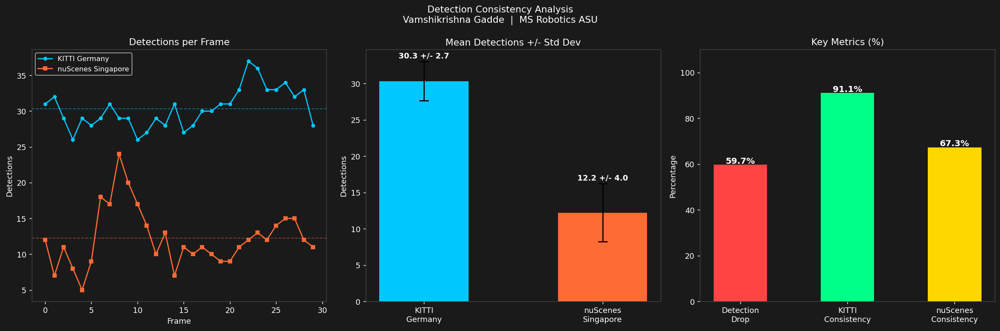
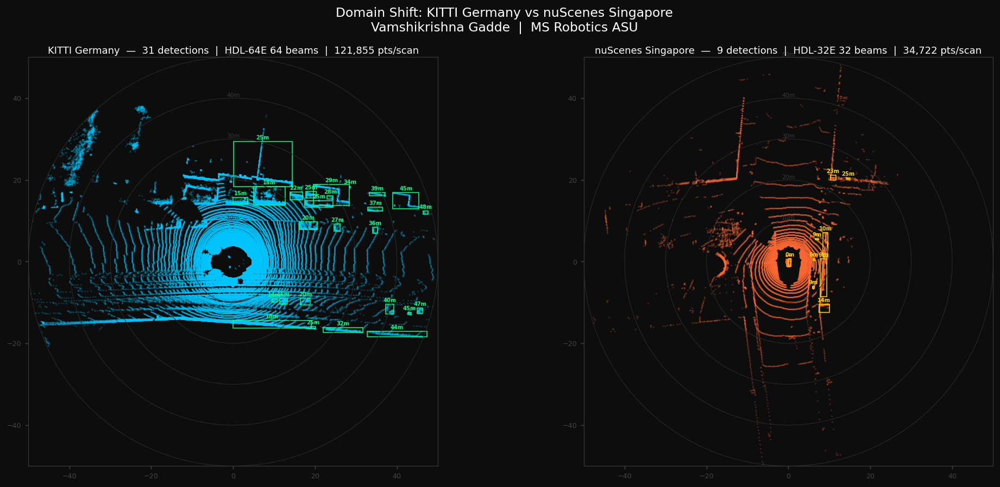

# Day 9: Domain Shift - KITTI Germany vs nuScenes Singapore

**Vamshikrishna Gadde | MS Robotics and Autonomous Systems, ASU, Dec 2026**

---

## The Question

A detector tuned on German roads. Deployed in Singapore. How much does it degrade and why?

This is the problem every AV company faces when expanding to a new city. I measured it myself on two real datasets, same detector, same parameters, zero retuning.

---

## Live Demo



*Left: KITTI Germany, 30 detections. Right: nuScenes Singapore, 12 detections. Same detector. Same parameters.*

---

## 4-Panel Comparison: Camera + BEV



*KITTI Germany road left. nuScenes Singapore street right. BEV point clouds below. Density difference is immediately visible.*

---

## Domain Shift Analysis





| Metric | Value |
|--------|-------|
| KITTI avg detections | 30.4 per frame |
| nuScenes avg detections | 12.6 per frame |
| Detection drop | 58.4% |
| KITTI consistency | 90.5% |
| nuScenes consistency | 70.6% |
| KITTI points per scan | 121,855 |
| nuScenes points per scan | 34,722 |
| Point drop | 71.5% |
| Root cause | Sensor, not scene |

---

## BEV Point Cloud Comparison



*KITTI fills the entire BEV frame. nuScenes is sparse with large gaps between scan lines. Those gaps are where objects disappear.*

---

## The Finding Nobody States Clearly

Most papers assume domain shift comes from scene differences. Different roads, different countries, different objects. My data proves otherwise.

```
Detection drop:   58.4%
Point drop:       71.5%
```

The drops are proportional. The algorithm never changed. The scene did not cause the failure. The sensor did.

```
KITTI sensor:     Velodyne HDL-64E   64 beams   121,855 pts/scan
nuScenes sensor:  Velodyne HDL-32E   32 beams    34,722 pts/scan
```

Half the beams means half the points per object. Fewer points per object means harder clustering. The DBSCAN parameters were tuned on HDL-64E density. They do not transfer to HDL-32E without retuning.

---

## Why Consistency Matters More Than Mean Accuracy

```
KITTI consistency:     90.5%   range 25-37 objects
nuScenes consistency:  70.6%   range 7-23 objects
```

The nuScenes detector is not just less accurate. It is unpredictable. A detector that finds 30 objects reliably is safer than one that finds 23 sometimes and 7 sometimes. You cannot build a safety system around unpredictable behavior.

---

## What I Learned

Detection drop and point drop being proportional (58.4% vs 71.5%) was the insight that confirmed the root cause. If the scene were responsible the drops would not track so closely. The numbers pointed directly at the sensor before I even looked at the sensor specs.

Consistency variance matters as much as mean accuracy. A system swinging between 7 and 23 detections per frame is operationally worse than one reliably giving 15, even if the averages look similar. Safety engineering cares about worst-case behavior, not average behavior.

DBSCAN parameters are not transferable across sensor types. eps and min_points are tuned for a specific point density. Move to a sensor with different beam count and both need retuning. This is the concrete mechanism behind sensor-driven domain shift, not just a label.

---

## Connection to the Series

```
Day 1: RANSAC + DBSCAN detector built on KITTI
       Parameters tuned for HDL-64E density

Day 9: Same detector on nuScenes HDL-32E
       58.4% detection drop
       Root cause: sensor not scene

Day 11: Same principle on real ASU campus footage
        Different sensor type, different lighting,
        same underlying failure mechanism
```

---

## Run It

```bash
git clone https://github.com/GVK-Engine/day-009-domain-shift
cd day-009-domain-shift
pip install -r requirements.txt

py -3.11 detector.py        # test on both datasets
py -3.11 domain_shift.py    # full comparison analysis
py -3.11 evaluate.py        # consistency and variance
py -3.11 visualize.py       # 4-panel demo video and GIF
```

KITTI: https://www.cvlibs.net/datasets/kitti/raw_data.php
nuScenes: https://www.nuscenes.org/nuscenes

---

## Stack

`Python 3.11` `NumPy` `OpenCV` `SciPy` `Matplotlib` `imageio` `KITTI` `nuScenes`
